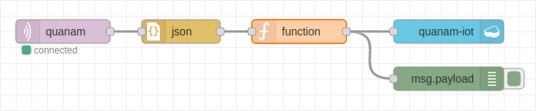

# Desafio

## Proposta

A proposta do desafio da Quanam encontra-se no submódulo "desafio".

## Solução

Para a solução do desafio na plataforma da *IBM Cloud*, foi utilizado o
*Node-RED* (ver [node-red-flows.json](solução/node-red-flows.json)) para
coletar documentos em formato JSON de um dispositivo IOT da Quanam via
protocolo MQTT e armazená-los em um banco de dados *NoSQL* (o *Cloudant*):

Depois, esses dados foram salvos em um arquivo [iot.csv](solução/iot.csv) e
explorados em um *Jupyter notebook* (ver [notebook.ipynb](solução/notebook.ipynb)),
hospedado no *Watson Studio*, com o qual também foram treinados modelos de
*machine learning* para uma comparação de seu desempenho. O melhor modelo foi
então utilizado para fazer previsões do ritmo cardíaco de pacientes, e preencher
a coluna `RYTHM` do arquivo [answers.csv](desafio/assets/answers.csv).