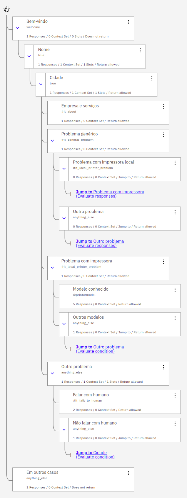

# Maratona Behind The Code 2021

Este repositório reúne os códigos e recursos que utilizei para resolver os
cinco desafios de negócio propostos na
[Maratona Behind The Code](https://maratona.dev/pt) da IBM de 2021.

A descrição e os arquivos fornecidos como base para cada desafio encontram-se
no subdiretório "desafio" correspondente (que é um submódulo do git, clonado a
partir dos repositórios da maratona).

No conjunto, as soluções submetidas para os cinco desafios garantiram o 53º
lugar no [TOP 100 da América Latina](https://maratona.dev/ranking),
e a oportunidade de participar da final da Maratona:

## Desafios

### Bantotal

O [desafio proposto pela Bantotal](https://github.com/maratonadev/desafio-1-2021) encontra-se no submódulo "1-bantotal/desafio".

Para a solução deste desafio de ciência de dados na plataforma da *IBM Cloud*,
foi utilizado um *Jupyter Notebook*, hospedado no *Watson Studio*
(ver [notebook.ipynb](1-bantotal/solução/notebook.ipynb)), para analisar dados de clientes
de bancos e desenvolver um modelo de aprendizagem de máquina para predizer se
um empréstimo a um cliente deve ou não ser feito. O modelo resultante foi
publicado em uma instância do *Watson Machine Learning*, e recebeu melhorias
incrementais até alcançar um bom desempenho. A versão final foi usada para
preencher o arquivo de respostas, [ANSWERS.csv](1-bantotal/solução/ANSWERS.csv),
garantindo o 6º lugar no
[ranking do 1º desafio](https://maratona.dev/ranking/1).

### Quanam

O [desafio proposto pela Quanam](https://github.com/maratonadev/desafio-2-2021) encontra-se no submódulo "2-quanam/desafio".

Para a solução do desafio na plataforma da *IBM Cloud*:

1. Foi utilizado o *Cloud Functions* para criar uma API *serverless* que recebe
dados de sensores e retorna uma lista de alertas quando as medições de um ou
mais destes sensores alcançam valores diferentes do esperado. O diretório
*[sensor_alert](2-quanam/solução/sensor_alert)* contém o
[código da *Action* que define a API](2-quanam/solução/sensor_alert/src/main.py) e
[alguns testes unitários](2-quanam/solução/sensor_alert/tests/test_main.py).
2. Com o *Node-RED* (ver [node-red-flows.json](2-quanam/solução/node-red-flows.json)),
foram coletados documentos em formato JSON de um dispositivo IOT da Quanam, via
protocolo MQTT, para posterior armazenamento em um banco de dados *NoSQL*
(o *Cloudant*):

  Depois, esses dados foram salvos em um arquivo [iot.csv](2-quanam/solução/iot.csv) e
explorados em um *Jupyter notebook* (ver [notebook.ipynb](2-quanam/solução/notebook.ipynb)),
hospedado no *Watson Studio*, com o qual também foram treinados modelos de
*machine learning* para uma comparação de seu desempenho. O melhor modelo foi
então utilizado para fazer previsões do ritmo cardíaco de pacientes, e preencher
a coluna `RYTHM` do arquivo [answers.csv](2-quanam/solução/answers.csv),
garantindo o 17º lugar no
[ranking do 2º desafio](https://maratona.dev/ranking/2).

### GFT

O [desafio proposto pela GFT](https://github.com/maratonadev/desafio-3-2021) encontra-se no submódulo "3-gft/desafio".

Para a solução deste desafio de aprendizagem não-supervisionada na plataforma
da *IBM Cloud*, foi utilizado um *Jupyter Notebook* (ver
[notebook.ipynb](3-gft/solução/notebook.ipynb)), hospedado no
*Watson Studio*, para:

- Agregar as bases de dados de clientes de um banco de varejo, um banco de
  investimentos e uma seguradora
- Tratar os dados, removendo itens duplicados, e transformando os demais para
  um formato adequado para o uso em um modelo de recomendação de produtos
- Gerar regras de associação com um nível adequado de confiabilidade, por meio
  do algotimo [Apriori](https://github.com/tommyod/Efficient-Apriori)
- Preencher o arquivo de respostas, [ANSWERS.csv](3-gft/solução/ANSWERS.csv), com até
  três produtos por cliente

A solução proposta ficou em 79º lugar no
[ranking do 3º desafio](https://maratona.dev/ranking/3).

### Algar Tech

O [desafio proposto pela Algar Tech](https://github.com/maratonadev/desafio-4-2021) encontra-se no submódulo "4-algar-tech/desafio".

Para a solução do desafio na plataforma da *IBM Cloud*, foi construído o
diálogo de um *chatbot*, utilizando o *Watson Assistent* (ver arquivo
[skill-fake-it-solutions.json](4-algar-tech/solução/skill-fake-it-solutions.json)) para o
*processamento de linguagem natural* (*NLP*). O resultado foi um
*assistente virtual inteligente*, integrado a uma API, capaz de interagir
com o usuário identificando suas intenções (saudação, pedido de ajuda, etc).

A figura a seguir mostra um diagrama do diálogo construído:

A solução proposta ficou em 84º lugar no
[ranking do 4º desafio](https://maratona.dev/ranking/4).

### Sonda

O [desafio proposto pela SONDA](https://github.com/maratonadev/desafio-5-2021) encontra-se no submódulo "5-sonda/desafio".

Para a solução deste desafio de ciência de dados na plataforma da *IBM Cloud*,
foi utilizado um *Jupyter Notebook*, hospedado no *Watson Studio*
(ver [notebook.ipynb](5-sonda/solução/notebook.ipynb)), para analisar dados de clientes
de uma empresa de telecomunicações (ver [dataset.csv](https://github.com/maratonadev/desafio-5-2021/blob/main/assets/data/dataset.csv))
e desenvolver modelos de aprendizagem de máquina para predizer se haverá ou
não a perda de um cliente (_churn_). Os modelos foram comparados, e o que teve
o melhor desempenho em termos do _F1 score_ foi utilizado para fazer previsões
para novos clientes e indicar na coluna `CHURN` do arquivo de respostas
(ver [ANSWERS.csv](5-sonda/solução/ANSWERS.csv)) quais deles serão perdidos.

A solução enviada ficou em 96º lugar no
[ranking do 5º desafio](https://maratona.dev/ranking/5).

## Edição anterior

Disponibilizei minhas soluções para os desafios de 2020 no repositório [maratona-behind-the-code-2020](https://github.com/he7d3r/maratona-behind-the-code-2020).
