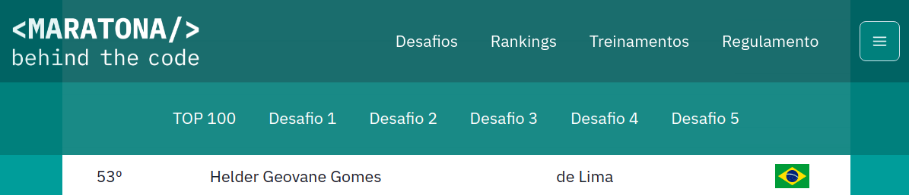

# Maratona Behind The Code 2021

Este repositório reúne os códigos e recursos que utilizei para resolver os
cinco desafios de negócio propostos na
[Maratona Behind The Code](https://maratona.dev/pt) da IBM de 2021.

A descrição e os arquivos fornecidos como base para cada desafio encontram-se
no subdiretório "desafio" correspondente (que é um submódulo do git, clonado a
partir dos repositórios da maratona).

No conjunto, as soluções submetidas para os cinco desafios garantiram o 53º
lugar no [TOP 100 da América Latina](https://maratona.dev/ranking),
e a oportunidade de participar da final da Maratona:

## Edição anterior

Disponibilizei minhas soluções para os desafios de 2020 no repositório [maratona-behind-the-code-2020](https://github.com/he7d3r/maratona-behind-the-code-2020).